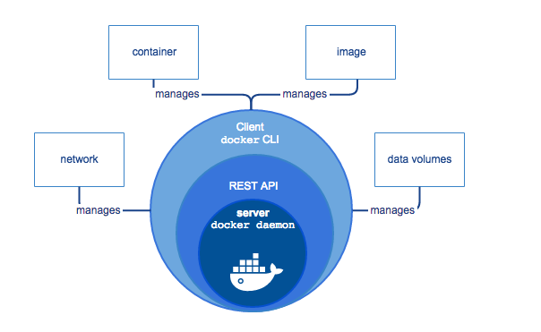

<h2>DOCKER</h2>

* <b>Container</b> : Container are code that isolates apps and its dependencies from the underlying infrastructure.A container is a runnable instance of an image. 
* <b>Containerization</b> : Containerization is the process of packaging an application along with its required dependencies.
* <b>Docker</b> : Docker is a popular program to create and run containers.
    Docker provides the ability to package and run an application in a loosely isolated 
    environment called a container. 
* <b>Docker File</b> : File containing the commands for building an image
* <b>Docker Image</b> : An image is a read-only template with instructions for creating a Docker container. 
* <b>Registry</b> : registry is a place to store docker image. eg is docker hub



The CLI uses the Docker REST API to control or interact with the Docker daemon through scripting or direct CLI commands.

````
$ docker run -i -t ubuntu /bin/bash
* When you run this command, the following happens (assuming you are using the default registry configuration):
* If you do not have the ubuntu image locally, Docker pulls it from your configured registry, 
  as though you had run docker pull ubuntu manually.
* Docker creates a new container, as though you had run a docker container create command 
  manually.
* Docker allocates a read-write filesystem to the container, as its final layer.
  This allows a running container to create or modify files and directories in its local filesystem.
* Docker creates a network interface to connect the container to the default network, 
  since you did not specify any networking options. This includes assigning an IP address
  to the container. By default, containers can connect to external networks using the host 
  machine’s network connection.
* Docker starts the container and executes /bin/bash. Because the container is running
  interactively and attached to your terminal (due to the -i and -t flags), you can provide 
  input using your keyboard while the output is logged to your terminal.
* When you type exit to terminate the /bin/bash command, the container stops but is not removed.
  You can start it again or remove it.
````

Namespaces

````
Namespaces
Docker uses a technology called namespaces to provide the isolated workspace called the container.
 When you run a container, Docker creates a set of namespaces for that container.

These namespaces provide a layer of isolation. Each aspect of a container runs in a separate 
namespace and its access is limited to that namespace.
````

````
Generic Docker Process

* create spring boot project
* run spring boot project using below command 
  mvn spring-boot:run
  localhost:9001/simpleHello
* build a project using below command
  mvn clean install -DskipTests
* For building an image use below command
 docker build -t tag-for-test-image:0.0.1 --build-arg PROJECT_JAR_VERSION=0.0.1-SNAPSHOT .
* Run -> docker images
    REPOSITORY              IMAGE ID        CREATED     SIZE        TAG
    tag-for-test-image      ID1                                 0.0.1
* how to run docker container from above created docker image
  docker run --rm -it -p 7007:9001 tag-for-test-image:0.0.1 registry
* Above command will run an instance of your application via docker.
  now we can access application using docker port
  localhost:7007/simpleHello 
* docker ps ==> shows only running containers
  CONATAINER ID     IMAGE                       COMMAND     CREATED     STATUS      PORTS       NAMES      
   CID1             tag-for-test-image:0.0.1    JAVA -Jar                           6000/tcp
* docker ps -a ===> show all containers (running/exited) 
  CONATAINER ID     IMAGE                       COMMAND     CREATED     STATUS      PORTS       NAMES      
   CID1             tag-for-test-image:0.0.1    JAVA -Jar                           6000/tcp
* docker rm IMAGE_ID

````

Docker Commands

````
* docker build -t tag-for-test-image:0.0.1 --build-arg PROJECT_JAR_VERSION=0.0.1-SNAPSHOT .
* docker images
* docker run --rm -it -p 7007:9001 tag-for-test-image:0.0.1 registry
* docke ps 
* docker ps -a
* docker rm IMAGE_ID
* docker tag tag-for-test-image:0.0.1 localhost:5000/tag-for-test-image:0.0.1
* docker push localhost:5000/tag-for-test-image:0.0.1
* docker pull localhost:5000/tag-for-test-image:0.0.1
````