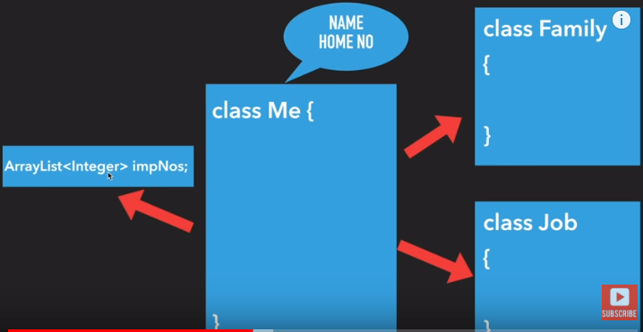
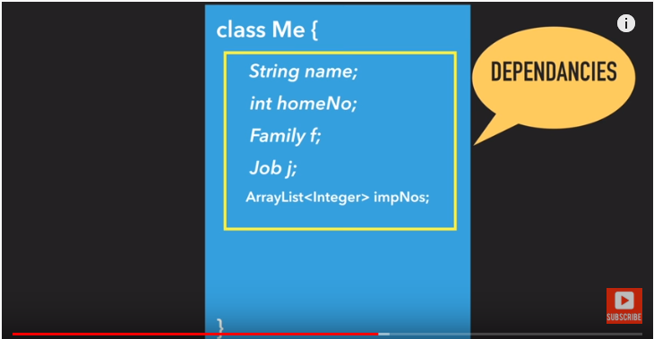
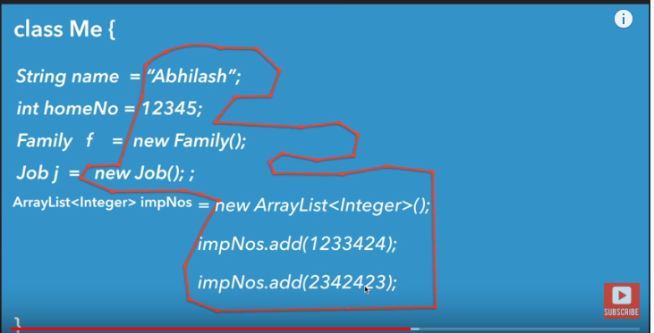
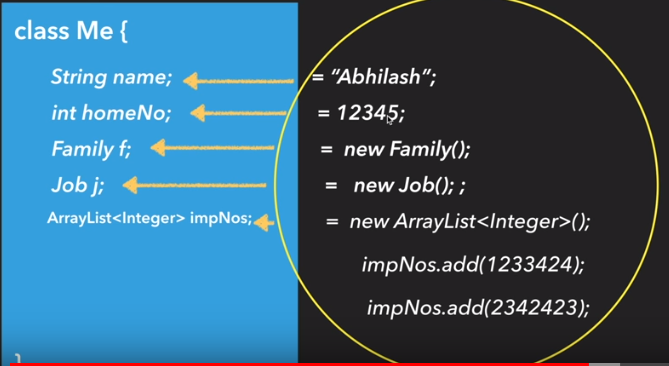
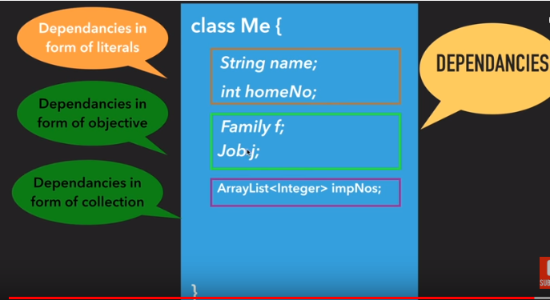

<h2>SPRING BOOT</h2>

<a>https://guides.github.com/features/mastering-markdown/</a>

<h3> What Is Inversion of Control?</h3>
Inversion of Control is a principle in software engineering by which the control of objects or portions of a program is transferred to a container or framework. It's most often used in the context of object-oriented programming.







<b>@PostConstruct</b> -> Spring calls methods annotated with @PostConstruct only once, just after the initialization of bean properties. Keep in mind that these methods will run even if there is nothing to initialize.
The method annotated with @PostConstruct can have any access level but it can't be static.
One example usage of @PostConstruct is populating a database. During development, for instance, we might want to create some default users

<b>@PreDestroy</b> ->A method annotated with @PreDestroy runs only once, just before Spring removes our bean from the application context.
Same as with @PostConstruct, the methods annotated with @PreDestroy can have any access level but can't be static.
    
````java
package com.fda.restaurant.restaurant.config;

import com.fda.restaurant.restaurant.dao.Dishes;
import com.fda.restaurant.restaurant.dao.Restaurant;
import com.fda.restaurant.restaurant.repository.RestaurantRepository;
import lombok.extern.slf4j.Slf4j;
import org.springframework.beans.factory.annotation.Autowired;
import org.springframework.boot.CommandLineRunner;
import org.springframework.context.annotation.Bean;
import org.springframework.context.annotation.Configuration;

import javax.annotation.PostConstruct;
import javax.annotation.PreDestroy;

import static com.fda.restaurant.restaurant.dao.Cuisines.CHINESE;
import static com.fda.restaurant.restaurant.dao.Cuisines.INDIAN;
import static com.fda.restaurant.restaurant.dao.VegOrNonVeg.NON_VEG;
import static com.fda.restaurant.restaurant.dao.VegOrNonVeg.VEG;

@Configuration
@Slf4j
class LoadDatabase {

    @Autowired
    private RestaurantRepository repository1;

    @Bean
    CommandLineRunner initDatabase(RestaurantRepository repository) {
        return args -> {
            log.info("PreLoading " + repository.save(new Restaurant("Delhi Pub", VEG, INDIAN,400,new Dishes("COFFEE",100))));
            log.info("PreLoading " + repository.save(new Restaurant("Delhi Continental", NON_VEG, CHINESE,600,new Dishes("SWEETS",600))));
        };
    }

    @PostConstruct
    public void addDefaultRestaurant()
    {
        log.info("PreLoading " + repository1.save(new Restaurant("PostDestroyExample", VEG, INDIAN,400,new Dishes("COFFEE",100))));
    }

    @PreDestroy
    public void removeDefaultRestaurant()
    {
        System.out.println("Remove Default Restaurant");
    }
}
````

