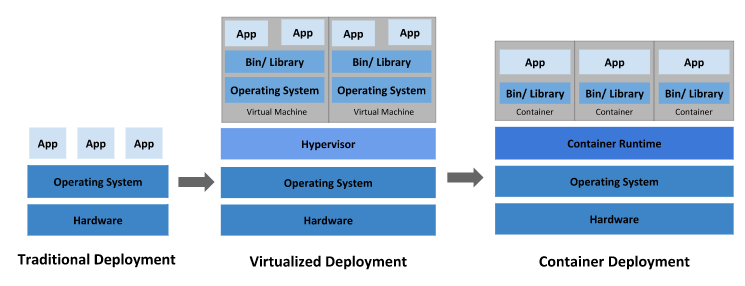
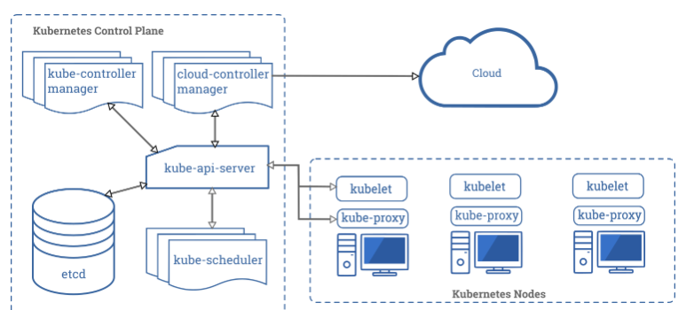

<h2>KUBERNETES</h2>

Kubernetes is an open source container orchestration engine for automating deployment,
scaling, and management of containerized applications.




<h3>Control Plane</h3>
<b>kube-apiserver</b>
The API server is a component of the Kubernetes control plane that exposes the Kubernetes API. The API server is the front end for the Kubernetes control plane.

<b>etcd</b>
Consistent and highly-available key value store used as Kubernetes’ backing store for all cluster data.

<b>kube-scheduler</b>
Control Plane component that watches for newly created pods with no assigned node, and selects a node for them to run on.

<b>kube-controller-manager</b>
Control Plane component that runs controller processes.
Logically, each controller is a separate process, but to reduce complexity, they are all compiled into a single binary and run in a single process.
These controllers include:
Node Controller: Responsible for noticing and responding when nodes go down.
Replication Controller: Responsible for maintaining the correct number of pods for every replication controller object in the system.
Endpoints Controller: Populates the Endpoints object (that is, joins Services & Pods).
Service Account & Token Controllers: Create default accounts and API access tokens for new namespaces.

<h3>Node Components</h3>

<b>kubelet</b>
An agent that runs on each node in the cluster. It makes sure that containers are running in a pod.

<b>kube-proxy</b>
kube-proxy is a network proxy that runs on each node in your cluster, implementing part of the Kubernetes Service concept.

<b>Container Runtime</b>
The container runtime is the software that is responsible for running containers

````
Kubernetes objects are persistent entities in the Kubernetes system. Kubernetes uses these entities to represent the state of your cluster. Specifically, they can describe:

What containerized applications are running (and on which nodes)
The resources available to those applications
The policies around how those applications behave, such as restart policies, upgrades, and fault-tolerance

To work with Kubernetes objects–whether to create, modify, or delete them–you’ll need to use the Kubernetes API. When you use the kubectl command-line interface, for example, the CLI makes the necessary Kubernetes API calls for you. You can also use the Kubernetes API directly in your own programs using one of the Client Libraries.
````

````
Object Spec and Status
Every Kubernetes object includes two nested object fields that govern the object’s configuration:
the object spec and the object status. The spec, which you must provide, describes your desired
state for the object–the characteristics that you want the object to have. The status describes
the actual state of the object, and is supplied and updated by the Kubernetes system. At any 
given time, the Kubernetes Control Plane actively manages an object’s actual state to match the
desired state you supplied.

Most often, you provide the information to 
kubectl in a .yaml file. kubectl converts the information to JSON when making the API request.
````

````
* Create deployments
  kubectl create deployment tag-for-test-image --image=localhost:5000/tag-for-test-image:0.0.1
  ---> create deployment using .yaml
  kubectl apply -f https://k8s.io/examples/application/deployment.yaml --record

````
deployment.yaml
````yaml 
apiVersion: apps/v1 # for versions before 1.9.0 use apps/v1beta2
kind: Deployment
metadata:
  name: nginx-deployment
spec:
  selector:
    matchLabels:
      app: nginx
  replicas: 2 # tells deployment to run 2 pods matching the template
  template:
    metadata:
      labels:
        app: nginx
    spec:
      containers:
      - name: nginx
        image: nginx:1.7.9
        ports:
        - containerPort: 80
````

````
 kubectl create deployment tag-for-test-image --image=localhost:5000/tag-for-test-image:0.0.1
 OR
 kubectl apply -f https://k8s.io/examples/application/deployment.yaml --record
 kubectl get deployments
 kubectl get pods
 kubectl describe pod podName
 kubectl logs podName
 kubectl logs -f podName
 kubectl edit deployment deploymentName
 kubectl apply -f Service.yaml
 


````

````
Updating Images
The default pull policy is IfNotPresent which causes the Kubelet to skip pulling an image if it already exists. If you would like to always force a pull, you can do one of the following:

set the imagePullPolicy of the container to Always.
omit the imagePullPolicy and use :latest as the tag for the image to use.
omit the imagePullPolicy and the tag for the image to use.
enable the AlwaysPullImages admission controller.
````

Some examples of Controllers that contain one or more pods include:

Deployment
StatefulSet
DaemonSet

POD LIFECYCLE
1) PENDING
2) RUNNING
3) SUCCEEDED
4) FAILED
5) UNKNOWN

INIT CONTAINERS : A Pod can have multiple containers running apps within it,
 but it can also have one or more init containers, which are run before the app containers are started.

````
SERVICE


An abstract way to expose an application running on a set of Pods as a network service.
````
Service.yaml
````yaml
apiVersion: v1
kind: Service
metadata:
  name: my-service
spec:
  selector:
    app: MyApp
  ports:
    - protocol: TCP
      port: 80
      targetPort: 9376
````

Service.yaml
````yaml
apiVersion: v1
kind: Service
metadata:
  name: new-name-service
spec:
  selector:
    app: tag-for-test-image
  ports:
    - protocol: TCP
      port: 80
      targetPort: 9376
````

--> paste your Service.yaml in your location

kubectl apply -f Service.yaml

-->run ifconfig and get ip from wlp4s0

 ip:portOfService/simpleHello


<h3>DEFINITION</h3>

````
Pod : The smallest and simplest Kubernetes object. A Pod represents a set of running containers on your cluster.[+]

Container : A lightweight and portable executable image that contains software and all of its dependencies

Container Runtime : The container runtime is the software that is responsible for running containers

Control Plane : The container orchestration layer that exposes the API and interfaces to define, deploy, and manage the lifecycle of containers.

Deployment : An API object that manages a replicated application.

Image : Stored instance of a container that holds a set of software needed to run an application.

Ingress : An API object that manages external access to the services in a cluster, typically HTTP.

Init ContainerOne or more initialization containers that must run to completion before any app containers run.

kube-proxy : kube-proxy is a network proxy that runs on each node in your cluster, implementing part of the Kubernetes Service concept

kube-scheduler : Control Plane component that watches for newly created pods with no assigned node, and selects a node for them to run on.

Kubectl : A command line tool for communicating with a Kubernetes API server.[+]

Kubelet : An agent that runs on each node in the cluster. It makes sure that containers are running in a pod.

Kubernetes API : The application that serves Kubernetes functionality through a RESTful interface and stores the state of the cluster

Namespace : An abstraction used by Kubernetes to support multiple virtual clusters on the same physical cluster

Selector : Allows users to filter a list of resources based on labels.

Service : An abstract way to expose an application running on a set of Pods as a network service 

StatefulSet : Manages the deployment and scaling of a set of Pods, and provides guarantees about the ordering and uniqueness of these Pods

UID : A Kubernetes systems-generated string to uniquely identify objects

Volume : A directory containing data, accessible to the containers in a pod
````


